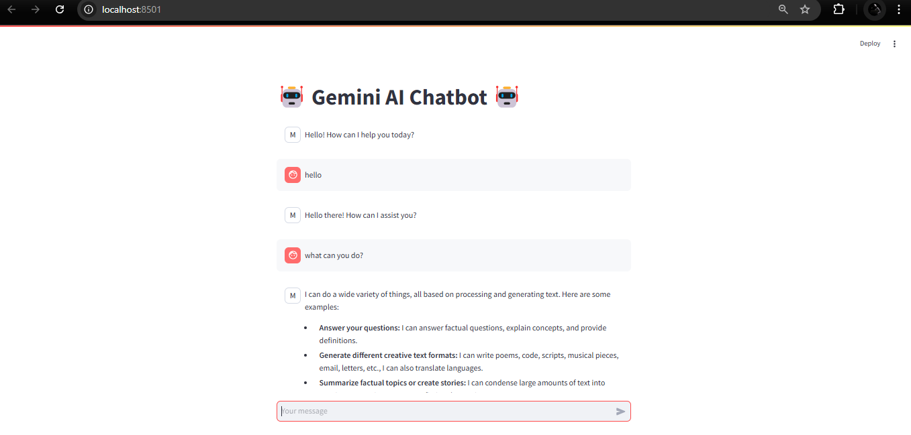

<h1>🤖 Gemini AI Chatbot</h1>

  A simple chatbot application built using Google Gemini AI and Streamlit. The chatbot leverages the Gemini API to provide concise, informative, and helpful responses to user queries. This project is ideal for experimenting with conversational AI models and learning how to integrate AI capabilities into applications.

<h2>Features</h2>
<ul>
  <li>Uses the Google Generative AI Gemini model for generating responses.</li>
  <li>Provides a simple chat interface built with Streamlit.</li>
  <li>Supports session-based chat history for continuous conversations.</li>
  <li>Customizable system prompt to modify the assistant's behavior.</li>
</ul>

<h2>Requirements</h2>
<ul>
  <li>Python 3.10 or later.</li>
  <li>A valid Google API key with access to the Gemini model.</li>
</ul>

<h2>Installation</h2>

Follow these steps to set up the project on your local machine:

<h3>1. Clone the Repository</h3>
<pre><code>git clone https://github.com/your-username/Gemini-Chatbot.git
cd Gemini-Chatbot
</code></pre>

<h3>2. Create a Virtual Environment</h3>
<pre><code>python -m venv venv
source venv/bin/activate    # For Linux/Mac
venv\Scripts\activate       # For Windows
</code></pre>

<h3>3. Install Dependencies</h3>

Install the required libraries:

<pre><code>pip install -r requirements.txt
</code></pre>

<h3>4. Set Up the Environment Variables</h3>

Create a <code>.env</code> file in the project root:

<pre><code>touch .env
</code></pre>

Add your Google API key to the <code>.env</code> file:

<pre><code>GOOGLE_API_KEY=your_google_api_key_here
</code></pre>

<h2>Running the Project</h2>
<pre><code>streamlit run app.py
</code></pre>

Open your browser and go to the URL provided by Streamlit (typically <code>http://localhost:8501</code>).

<h2>Project Structure</h2>
<pre><code>Gemini-Chatbot/
├── app.py               # Main Streamlit application file
├── .env                 # Environment variables file (not included in the repo)
├── requirements.txt     # Project dependencies
├── README.md            # Project documentation
└── venv/                # Virtual environment directory (not included in the repo)
</code></pre>

<h2>Customization</h2>
<h3>System Prompt</h3>

Modify the assistant's behavior by editing the <code>system_prompt</code> variable in <code>app.py</code>:

<pre><code>system_prompt = """You are a helpful AI assistant. Respond to user requests in a clear, concise, and informative manner."""
</code></pre>

<h3>Chatbot Appearance</h3>

<h2>Troubleshooting</h2>
<ul>
  <li>If the API key is invalid or missing, ensure the <code>.env</code> file is correctly set up and the key is valid.</li>
  <li>Make sure all dependencies are installed by running:</li>
</ul>
<pre><code>pip install -r requirements.txt
</code></pre>

<h2>License</h2>

This project is licensed under the MIT License. Feel free to modify and use it as needed.

<h2>Contributions</h2>

  Contributions, issues, and feature requests are welcome! Feel free to fork the repository and submit a pull request.

